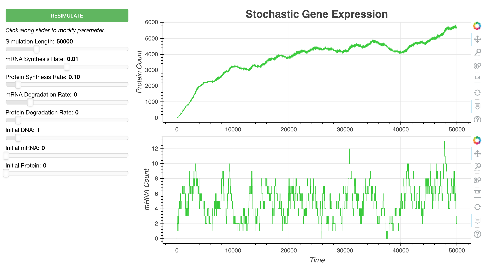

# Stochastic Simulation of Gene Expression

A [Bokeh](https://bokeh.pydata.org/en/1.0.3/) dashboard for simulating gene expression with the [Gillespie Algorithm](https://en.wikipedia.org/wiki/Gillespie_algorithm)!



## How to use the dashboard

To launch the dashboard, open a command line interface, navigate to the directory containing the project folder `SSgene`, and run the command 

```
bokeh serve --show SSgene
```

The dashboard will automatically open in your browser at the address `http://localhost:5006/SSgene`

You can use the dashboard's interactive controls to tune reaction paramaters and visualize protein and mRNA behavior over time.

The **RESILMULATE** button will generate new data using the exisitng set of reaction parameters. 
* Simulation Length
* mRNA Synthesis Rate
* Protein Synthesis Rate
* mRNA Degradation Rate
* Protein Degradation Rate
* Initial DNA Count
* Initial mRNA Count
* Initial Proteim Count
These paramaters can be adjusted by clicking along their respective slider. (I would advise against dragging the slider, since this will run a string of new simulations.) 

\begin{align*}
    DNA &\xrightarrow[]{S_M} DNA + mRNA\\
    mRNA &\xrightarrow[]{S_P} mRNA + Protein\\
    mRNA &\xrightarrow[]{D_M} \emptyset\\
    Protein &\xrightarrow[]{D_P} \emptyset
\end{align*}


## Background 

These instructions will get you a copy of the project up and running on your local machine for development and testing purposes. See deployment for notes on how to deploy the project on a live system.

### Prerequisites

What things you need to install the software and how to install them

```
Give examples
```

### Installing


```
Give the example
```


## Stochastic Simulation Algorithm 


## Bokeh Dashboard

Add additional notes about how to deploy this on a live system

## Built With

* [Dropwizard](http://www.dropwizard.io/1.0.2/docs/) - The web framework used
* [Maven](https://maven.apache.org/) - Dependency Management
* [ROME](https://rometools.github.io/rome/) - Used to generate RSS Feeds

## Contributing

Please read [CONTRIBUTING.md](https://gist.github.com/PurpleBooth/b24679402957c63ec426) for details on our code of conduct, and the process for submitting pull requests to us.

## Versioning

We use [SemVer](http://semver.org/) for versioning. For the versions available, see the [tags on this repository](https://github.com/your/project/tags). 

## Authors

* **Billie Thompson** - *Initial work* - [PurpleBooth](https://github.com/PurpleBooth)

See also the list of [contributors](https://github.com/your/project/contributors) who participated in this project.

## License

This project is licensed under the MIT License - see the [LICENSE.md](LICENSE.md) file for details

## Acknowledgments

* Hat tip to anyone whose code was used
* Inspiration
* etc

